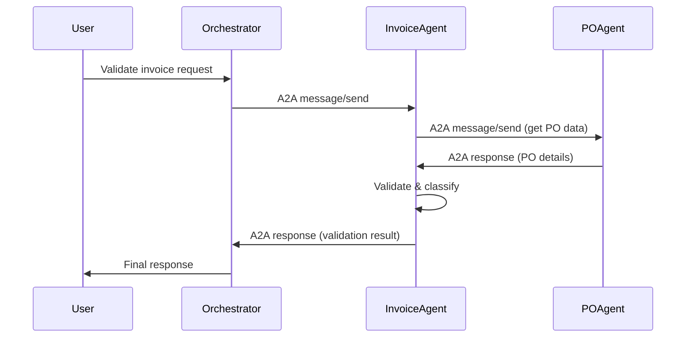

# A2A Multi-Agent Demo with KEDA Scaling on AKS

A demonstration of multiple AI agents communicating via the **A2A (Agent-to-Agent) Protocol**, built using the **A2A Python SDK** and **LangGraph** with skills, deployed on **Azure Kubernetes Service (AKS)** with **KEDA** event-driven autoscaling.

## Architecture Overview

```
┌─────────────────────────────────────────────────────────────────────────────┐
│                              Azure Kubernetes Service                        │
├─────────────────────────────────────────────────────────────────────────────┤
│                                                                              │
│  ┌───────────────────────┐    A2A Protocol    ┌──────────────────────────┐  │
│  │   Orchestrator Agent  │◄──────────────────►│  Invoice Validation Agent│  │
│  │   (Host - Port 8080)  │                    │      (Port 8081)         │  │
│  │                       │                    │   - Validate invoices    │  │
│  │   - Route requests    │    A2A Protocol    │   - Check compliance     │  │
│  │   - Coordinate agents │◄──────────────────►│   - Match PO/GR data     │  │
│  │   - Aggregate results │                    └──────────────────────────┘  │
│  └───────────────────────┘                                                  │
│           │                                                                  │
│           │ A2A Protocol                                                     │
│           ▼                                                                  │
│  ┌───────────────────────┐                    ┌──────────────────────────┐  │
│  │  Purchase Order Agent │                    │    Azure Service Bus     │  │
│  │      (Port 8082)      │◄───────────────────│    (Message Queue)       │  │
│  │   - Fetch PO data     │                    │                          │  │
│  │   - Match invoices    │                    │  KEDA ScaledObject       │  │
│  │   - Track receipts    │                    │  monitors queue length   │  │
│  └───────────────────────┘                    └──────────────────────────┘  │
│                                                                              │
│  ┌─────────────────────────────────────────────────────────────────────────┐│
│  │ KEDA - Event-Driven Autoscaling                                         ││
│  │  - Scale invoice-agent: 0→10 replicas based on queue depth              ││
│  │  - Scale po-agent: 0→5 replicas based on HTTP request rate              ││
│  └─────────────────────────────────────────────────────────────────────────┘│
└─────────────────────────────────────────────────────────────────────────────┘
```

## Demo Scenario

**Finance/Accounts Payable Processing:**

1. **User** submits an invoice via the Orchestrator Agent
2. **Orchestrator** routes to Invoice Validation Agent via A2A
3. **Invoice Agent** validates structure and completeness
4. **Invoice Agent** requests PO data from Purchase Order Agent via A2A
5. **PO Agent** returns matching data for 3-way match
6. **Invoice Agent** classifies outcome and returns result
7. **Orchestrator** aggregates and responds to user

## Agents

### 1. Orchestrator Agent (Host)
- Entry point for user requests
- Discovers and routes to remote agents via A2A
- Built with LangGraph and Google ADK

### 2. Invoice Validation Agent
- Validates vendor invoices
- Classifies outcomes: Auto-processable, Mismatch, Approval Required, etc.
- Uses LangGraph skills for business logic

### 3. Purchase Order Agent
- Provides PO and goods receipt data
- Supports matching operations
- Handles data queries

## Tech Stack

- **A2A SDK**: `a2a-sdk>=0.2.1` - Agent-to-Agent Protocol implementation
- **LangGraph**: `langgraph>=0.3.18` - Agent framework with ReAct pattern
- **LangChain OpenAI**: `langchain-openai` - LLM integration
- **KEDA**: Event-driven autoscaling for Kubernetes
- **Azure Service Bus**: Message queue for scaling triggers
- **Azure Kubernetes Service**: Container orchestration

## Project Structure

```
a2a-multi-agent-keda-scaling/
├── agents/
│   ├── common/
│   │   └── servicebus.py           # Shared Azure Service Bus transport
│   ├── orchestrator/                # Host agent coordinating requests
│   │   ├── agent.py                 # LangGraph workflow + Service Bus support
│   │   └── server.py               # A2A Starlette server
│   ├── invoice_agent/               # Invoice processing agent
│   │   ├── agent.py                 # LangGraph validation workflow
│   │   └── server.py               # A2A server + Service Bus consumer
│   └── po_agent/                    # PO management agent
│       ├── agent.py                 # LangGraph PO workflow
│       └── server.py               # A2A server + Service Bus consumer
├── k8s/
│   ├── namespace.yaml
│   ├── configmap.yaml               # Agent config + Service Bus settings
│   ├── secrets.yaml                 # Azure OpenAI credentials
│   ├── orchestrator.yaml            # Orchestrator Deployment + Service
│   ├── invoice-agent.yaml           # Invoice Agent Deployment + Service
│   ├── po-agent.yaml                # PO Agent Deployment + Service
│   ├── redis.yaml                   # Redis for caching
│   └── keda/
│       ├── trigger-auth.yaml        # Workload Identity auth for KEDA
│       ├── invoice-scaledobject.yaml # Scale invoice-agent 0→10
│       └── po-scaledobject.yaml     # Scale po-agent 0→5
├── docker/
│   ├── docker-compose.yml
│   ├── Dockerfile.base
│   ├── Dockerfile.orchestrator
│   ├── Dockerfile.invoice
│   └── Dockerfile.po
├── scripts/
│   ├── setup-azure.sh               # Provision AKS + ACR + Service Bus + KEDA
│   └── demo-load.py                 # Flood queues to trigger KEDA scaling
├── pyproject.toml
├── requirements.txt
├── .env.example
├── DEMO.md
└── README.md
```

## Prerequisites

- Python 3.12+
- Azure CLI
- kubectl
- Docker
- Azure subscription with:
  - Azure Kubernetes Service
  - Azure Container Registry
  - Azure Service Bus
- OpenAI API key (or Azure OpenAI)

## Quick Start

### Local Development

1. **Install dependencies:**
   ```bash
   uv sync
   # or
   pip install -r requirements.txt
   ```

2. **Set environment variables:**
   ```bash
   cp .env.example .env
   # Edit .env with your API keys
   ```

3. **Run agents locally:**
   ```bash
   # Terminal 1 - Invoice Agent
   cd agents/invoice_validation && uv run . --port 8081

   # Terminal 2 - PO Agent
   cd agents/purchase_order && uv run . --port 8082

   # Terminal 3 - Orchestrator
   cd agents/orchestrator && uv run . --port 8080
   ```

4. **Test A2A communication:**
   ```bash
   curl -X POST http://localhost:8080 \
     -H "Content-Type: application/json" \
     -d '{
       "jsonrpc": "2.0",
       "id": 1,
       "method": "message/send",
       "params": {
         "message": {
           "role": "user",
           "parts": [{"type": "text", "text": "Validate invoice #INV-2024-001 for vendor ACME Corp, amount $5,000"}]
         }
       }
     }'
   ```

### AKS Deployment

1. **Setup Azure resources (AKS + ACR + Service Bus + KEDA):**
   ```bash
   ./scripts/setup-azure.sh
   ```

2. **Build and push images:**
   ```bash
   az acr build --registry $ACR_NAME --image a2a-orchestrator:latest -f docker/Dockerfile.orchestrator .
   az acr build --registry $ACR_NAME --image a2a-invoice-agent:latest -f docker/Dockerfile.invoice .
   az acr build --registry $ACR_NAME --image a2a-po-agent:latest -f docker/Dockerfile.po .
   ```

3. **Deploy to AKS:**
   ```bash
   kubectl apply -f k8s/namespace.yaml
   kubectl apply -f k8s/
   kubectl apply -f k8s/keda/
   ```

4. **Verify KEDA ScaledObjects:**
   ```bash
   kubectl get scaledobjects -n a2a-agents
   kubectl get pods -n a2a-agents
   ```

## KEDA Scaling Demo

The demo showcases event-driven autoscaling with KEDA:

### Scaling Triggers

1. **Azure Service Bus Queue Length**
   - Invoice agent scales 0→10 based on pending invoice messages
   - Scale up when queue > 5 messages
   - Scale down when queue empty for 5 minutes

2. **Azure Service Bus Queue Length**
   - PO agent scales 0→5 based on pending PO messages
   - Scale up when queue > 3 messages

### Demonstrate Scaling

```bash
# Terminal 1 — Watch pods scale up in real-time
kubectl get pods -n a2a-agents -w

# Terminal 2 — Flood the invoice queue with 50 messages
python scripts/demo-load.py --count 50 --queue invoice-requests

# Terminal 3 — Monitor KEDA ScaledObjects
kubectl get scaledobjects -n a2a-agents -w
```

### What the Customer Sees

1. Initially: 0 invoice-agent pods (scale-to-zero)
2. Load test sends 50 messages to `invoice-requests` queue
3. Within 15s, KEDA detects queue depth and starts scaling pods
4. Pods scale up to handle the messages (up to 10 replicas)
5. As messages are processed, queue drains
6. After 5 min cooldown, pods scale back to 0

## A2A Protocol Flow



## Environment Variables

| Variable | Description | Required |
|----------|-------------|----------|
| `OPENAI_API_KEY` | OpenAI API key | Yes |
| `AZURE_SERVICEBUS_CONNECTION` | Service Bus connection string | For KEDA |
| `SERVICEBUS_FQDN` | Service Bus FQDN (e.g. `myns.servicebus.windows.net`) | For KEDA |
| `USE_SERVICEBUS` | Set `true` to enable queue-based communication | For KEDA |
| `INVOICE_AGENT_URL` | Invoice agent A2A endpoint | Yes |
| `PO_AGENT_URL` | PO agent A2A endpoint | Yes |
| `LOG_LEVEL` | Logging level (DEBUG/INFO/WARN) | No |

## Related Resources

- [A2A Protocol Documentation](https://goo.gle/a2a)
- [A2A Python SDK](https://github.com/a2aproject/a2a-python)
- [LangGraph Documentation](https://langchain-ai.github.io/langgraph/)
- [KEDA Documentation](https://keda.sh)
- [Azure Kubernetes Service](https://docs.microsoft.com/azure/aks/)

## License

MIT License
